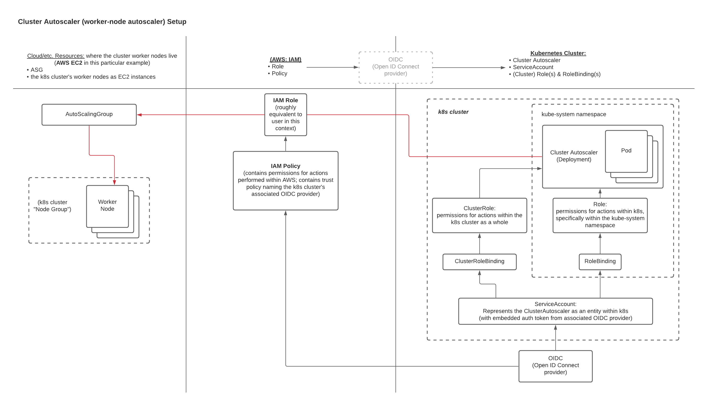

# Kubernetes "Demo": Cluster Autoscaling & Intro to K8s AuthN/AuthZ

## Goals

* Configure and test cluster (worker-node) autoscaling
* Examine some AuthN/AuthZ concepts and resources en route to setting up the cluster autoscaler

## Lab

### 1. Setup

Check out [the oct13demo](https://github.com/itt-learning-groups/todoapi/tree/oct13demo) branch of the `todoapi` repo in us-learn-and-devops GitHub.

    git fetch --all
    git checkout sept29demo

Deploy the cluster:

    cd build/
    ./cluster-deploy.sh

### 2. Concepts

We've been working with pod autoscaling. Now it's time to shift focus up a level to autoscaling the cluster (worker) nodes, too:

#### How cluster autosclaing works

Components (in AWS EKS):

* Cluster node-group(s) containing worker nodes (e.g. EC2 virtual-machine instances if we're not running the cluster in ECS Fargate)
* An autoscaling-group ("ASG") controlling the node-group instances
* A cluster-autoscaler pod (courtesy of a publicly-available image we'll pull from Google Cloud Platform's cloud registry [here](https://console.cloud.google.com/gcr/images/k8s-artifacts-prod/us/autoscaling/cluster-autoscaler)) we'll need to configure and deploy
  * It taps into the k8s API on the cluster to monitor the cluster's need to scale its worker-node count up or down
  * It does that by controlling the ASG that's controlling the node-group instances
* Authentication ("AuthN") and authorization ("AuthZ") setup in place to give the cluster-autoscaler an identity that can be verified when it makes requests to an AWS managed service like the EC2 autoscaling-group API, and to provide it with the permissions needed to carry out ASG actions on behalf of the cluster.
  * An identity provider for the cluster that can form a link between a k8s resource needing to perform actions in AWS and AWS's own identity service (IAM)
    * Open ID Connect (OIDC) provider
      * Based on OAuth 2.0
      * Uses auth tokens provided by and verified by an OIDC identity server
      * Client sends a token with its request to an API; the API server verifies the token with the OIDC provider to authenticate the client as geniune
      * EKS makes it quite easy to set up an OIDC provider and associate it with our cluster
  * An AWS IAM policy with the necessary authorization permissions our autoscaler needs
  * An AWS IAM role with the policy attached
  * A Service Account resource within our k8s cluster that can assume the IAM role via the OIDC-procider token it stores in a k8s secret
    * This can be a little tricky to set up, but `eksctl` will give us an easy way to do it in our demo, by running a Cloudformation stack to set it up for us
    * The Service Account name is part of the cluster-autoscaler pod's configuration, so it can use that Service Account to send its auth token with its API requests
  * Additional AuthZ resources in k8s that the cluster-autoscaler needs in the k8s cluster:
    * A ClusterRole and Role with permissions rules allowing actions to be performed in the cluster as a whole and specifically within the kube-system namespace
    * Role bindings to bind those roles to the Service Account our cluster-autoscaler uses

Here's some additional info on the cluster autoscaler from EKS: <https://docs.aws.amazon.com/eks/latest/userguide/cluster-autoscaler.html>.

And here's some additional info on how EKS uses OIDC: <https://docs.aws.amazon.com/eks/latest/userguide/iam-roles-for-service-accounts-technical-overview.html.>

It's worth noting that k8s ***does not*** support the concept of a user internally, which is why it's common to associate k8s role-based access with an external user database.

It's also worth noting that an OIDC provider is only one among many ways to authenticate requests with the k8s API. We'll likely spend a little more time on k8s RBAC before we finish up our k8s unit. Meanwhile, here's a good link to read up on it a bit: <https://www.cncf.io/blog/2020/07/31/kubernetes-rbac-101-authentication/>.

The `kubectl` context and requests we've been using to control our cluster use a certificate-based authentication setup.
If we have time today, we'll take a brief look at that. If not, we'll save that for when we circle back to k8s RBAC soon.

### 3. Manually scaling the cluster's worker nodes via its autoscaling group (ASG)

Check out the cluster's ASG config (you can do this in the AWS console, too):

    aws autoscaling \
      describe-auto-scaling-groups \
      --query "AutoScalingGroups[? Tags[? (Key=='eks:cluster-name') && Value=='learnanddevops2']].[AutoScalingGroupName, DesiredCapacity, MinSize, MaxSize]" \
      --output table

Note that this matches our `eksctl create cluster` command we use to spin up our cluster:

...And note that it also matches the worker-node count in the cluster right now:

We can *manually* autoscale the ASG:

    aws autoscaling \
      update-auto-scaling-group \
      --auto-scaling-group-name eks-38be3b48-3a91-9e1a-e0d8-ddd341e8ab01 \
      --min-size 1 \
      --desired-capacity 2 \
      --max-size 4

Wait a moment, and you should see...

### 4. Now set up cluster autoscaling so we don't have to do it manually

#### 4a. Set up the OIDC provider

First, we need to set up the AuthN/AuthZ pathway for the cluster autoscaler that we install to be able to control the ASG in AWS -- like we just did manually, but from *within* the k8s cluster's control plane using a k8s service account linked to an appropriate IAM role via an OIDC provider for the cluster.

Note that our cluster already has an OIDC provider issuer, but no identity providers have been created yet.

We'll use that OIDC provider issuer to create the OIDC provider we need, which is easiest using `eksctl`:

    eksctl utils associate-iam-oidc-provider --cluster learnanddevops2 --approve

#### 4b. Set up the IAM policy, role, and k8s Service Account able to assume the role

Create an IAM policy allowing ASG permissions:

    aws iam create-policy   \
      --policy-name k8s-asg-policy \
      --policy-document file://k8s-asg-policy.json

Create an IAM role for the cluster-autoscaler Service Account in the kube-system namespace.
Create that Service Account and associate the IAM role with it.
Easiest way is to again use `eksctl` for this. It will use a Cloudformation stack, which is sort-of overkill, but is easy for us, because it does everything in one step:

    eksctl create iamserviceaccount \
      --name cluster-autoscaler \
      --namespace kube-system \
      --cluster learnanddevops2 \
      --attach-policy-arn "arn:aws:iam::937489132779:policy/k8s-asg-policy" \
      --approve \
      --override-existing-serviceaccounts

#### 4c. Deploy the cluster-autoscaler and its internal k8s roles + role bindings

Check for the latest version of the kubernetes cluster-autoscaler that supports k8s 1.19 (which is the k8s version we're using -- it's the latest that eksctl supports):

Deploy the Cluster Autoscaler to our cluster.
The k8s Github repo for the cluster-autoscaler helpfully provides some [example](https://github.com/kubernetes/autoscaler/tree/master/cluster-autoscaler/cloudprovider/aws/examples) `yaml` manifests we can use with kubectl to do this, including [one](https://github.com/kubernetes/autoscaler/blob/master/cluster-autoscaler/cloudprovider/aws/examples/cluster-autoscaler-autodiscover.yaml) that most-closely matches our use-case.

Let's download it from <https://raw.githubusercontent.com/kubernetes/autoscaler/master/cluster-autoscaler/cloudprovider/aws/examples/cluster-autoscaler-autodiscover.yaml> into a local file `build/cluster-autoscaler.yaml` and update it a little according to our specific case.

(*Note that it assumes we have created a ServiceAccount named `cluster-autoscaler` -- which we just did, so that part is OK as-is.*)

The final result, taking into account some good advice from the AWS docs [here](https://docs.aws.amazon.com/eks/latest/userguide/cluster-autoscaler.html) and the cluster-autoscaler version we just chose, should look like this:

    ---
    apiVersion: rbac.authorization.k8s.io/v1
    kind: ClusterRole
    metadata:
      name: cluster-autoscaler
      labels:
        k8s-addon: cluster-autoscaler.addons.k8s.io
        k8s-app: cluster-autoscaler
    rules:
      - apiGroups: [""]
        resources: ["events", "endpoints"]
        verbs: ["create", "patch"]
      - apiGroups: [""]
        resources: ["pods/eviction"]
        verbs: ["create"]
      - apiGroups: [""]
        resources: ["pods/status"]
        verbs: ["update"]
      - apiGroups: [""]
        resources: ["endpoints"]
        resourceNames: ["cluster-autoscaler"]
        verbs: ["get", "update"]
      - apiGroups: [""]
        resources: ["nodes"]
        verbs: ["watch", "list", "get", "update"]
      - apiGroups: [""]
        resources:
          - "namespaces"
          - "pods"
          - "services"
          - "replicationcontrollers"
          - "persistentvolumeclaims"
          - "persistentvolumes"
        verbs: ["watch", "list", "get"]
      - apiGroups: ["extensions"]
        resources: ["replicasets", "daemonsets"]
        verbs: ["watch", "list", "get"]
      - apiGroups: ["policy"]
        resources: ["poddisruptionbudgets"]
        verbs: ["watch", "list"]
      - apiGroups: ["apps"]
        resources: ["statefulsets", "replicasets", "daemonsets"]
        verbs: ["watch", "list", "get"]
      - apiGroups: ["storage.k8s.io"]
        resources: ["storageclasses", "csinodes", "csidrivers", "csistoragecapacities"]
        verbs: ["watch", "list", "get"]
      - apiGroups: ["batch", "extensions"]
        resources: ["jobs"]
        verbs: ["get", "list", "watch", "patch"]
      - apiGroups: ["coordination.k8s.io"]
        resources: ["leases"]
        verbs: ["create"]
      - apiGroups: ["coordination.k8s.io"]
        resourceNames: ["cluster-autoscaler"]
        resources: ["leases"]
        verbs: ["get", "update"]
    ---

    apiVersion: rbac.authorization.k8s.io/v1
    kind: Role
    metadata:
      name: cluster-autoscaler
      namespace: kube-system
      labels:
        k8s-addon: cluster-autoscaler.addons.k8s.io
        k8s-app: cluster-autoscaler
    rules:
      - apiGroups: [""]
        resources: ["configmaps"]
        verbs: ["create","list","watch"]
      - apiGroups: [""]
        resources: ["configmaps"]
        resourceNames: ["cluster-autoscaler-status", "cluster-autoscaler-priority-expander"]
        verbs: ["delete", "get", "update", "watch"]

    ---
    apiVersion: rbac.authorization.k8s.io/v1
    kind: ClusterRoleBinding
    metadata:
      name: cluster-autoscaler
      labels:
        k8s-addon: cluster-autoscaler.addons.k8s.io
        k8s-app: cluster-autoscaler
    roleRef:
      apiGroup: rbac.authorization.k8s.io
      kind: ClusterRole
      name: cluster-autoscaler
    subjects:
      - kind: ServiceAccount
        name: cluster-autoscaler
        namespace: kube-system

    ---
    apiVersion: rbac.authorization.k8s.io/v1
    kind: RoleBinding
    metadata:
      name: cluster-autoscaler
      namespace: kube-system
      labels:
        k8s-addon: cluster-autoscaler.addons.k8s.io
        k8s-app: cluster-autoscaler
    roleRef:
      apiGroup: rbac.authorization.k8s.io
      kind: Role
      name: cluster-autoscaler
    subjects:
      - kind: ServiceAccount
        name: cluster-autoscaler
        namespace: kube-system

    ---
    apiVersion: apps/v1
    kind: Deployment
    metadata:
      name: cluster-autoscaler
      namespace: kube-system
      labels:
        app: cluster-autoscaler
    spec:
      replicas: 1
      selector:
        matchLabels:
          app: cluster-autoscaler
      template:
        metadata:
          labels:
            app: cluster-autoscaler
          annotations:
            prometheus.io/scrape: 'true'
            prometheus.io/port: '8085'
            cluster-autoscaler.kubernetes.io/safe-to-evict: 'false'
        spec:
          priorityClassName: system-cluster-critical
          securityContext:
            runAsNonRoot: true
            runAsUser: 65534
            fsGroup: 65534
          serviceAccountName: cluster-autoscaler
          containers:
            - image: us.gcr.io/k8s-artifacts-prod/autoscaling/cluster-autoscaler:v1.19.2
              name: cluster-autoscaler
              resources:
                limits:
                  cpu: 100m
                  memory: 600Mi
                requests:
                  cpu: 100m
                  memory: 600Mi
              command:
                - ./cluster-autoscaler
                - --v=4
                - --stderrthreshold=info
                - --cloud-provider=aws
                - --skip-nodes-with-local-storage=false
                - --expander=least-waste
                - --node-group-auto-discovery=asg:tag=k8s.io/cluster-autoscaler/enabled,k8s.io/cluster-autoscaler/learnanddevops2
                - --balance-similar-node-groups
                - --skip-nodes-with-system-pods=false
              volumeMounts:
                - name: ssl-certs
                  mountPath: /etc/ssl/certs/ca-certificates.crt #/etc/ssl/certs/ca-bundle.crt for Amazon Linux Worker Nodes
                  readOnly: true
              imagePullPolicy: "Always"
          volumes:
            - name: ssl-certs
              hostPath:
                path: "/etc/ssl/certs/ca-bundle.crt"

Now we can use `kubectl` to create the ClusterRole, Role, role bindings, and single-replica Deployment for the cluster-autoscaler itself.
We don't need to specify a namespace, because it's already specified (`kube-system`) for each resource in the `yaml` file:

    kubectl apply -f ./cluster-autoscaler.yaml

### 5. Test the cluster autoscaler

#### 5a. Deploy the `todoapi` with low replica count

Set environment vars in the terminal for Docker login, to create the `dockerlogin` secret (from values stored in LastPass for docker.com for brandallk):

    export DOCKER_SERVER="docker.io"
    export DOCKER_USERNAME=<redacted>
    export DOCKER_PSWD=<redacted>
    export DOCKER_EMAIL=<redacted>

Then run the `todoapi` deployment with just a single replica. We'll "goose" the cluster autoscaler in a moment by increasing the replica count.

    cd k8s
    ./deploy.sh dev

Looks OK so far...

#### 5b. Update the `todoapi` HPA to add more replicas and trigger the cluster autoscaler to request an additional worker node from its ASG

Now let's "goose" the cluster autoscaler.

    kubectl apply -f ./deployment.yaml -n dev
    kubectl apply -f ./hpa.yaml -n dev

Three of the new pods will be unschedulable, with no room on the current set of 2 worker nodes, so they'll be caught in `pending` state:

But wait a moment, and things should adjust:

Our cluster-autoscaler gave us a 3rd node by controling the ASG for the cluster's node-group in AWS:

### 6. Clean up

Don't forget to spin down all your AWS resources:

    cd ..
    ./cluster-destroy
